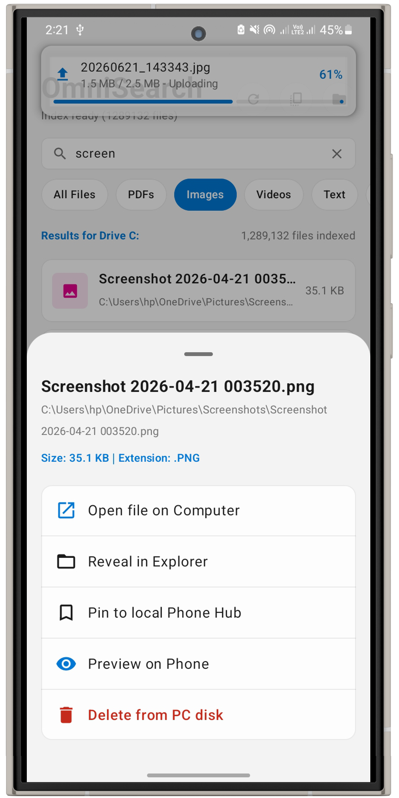
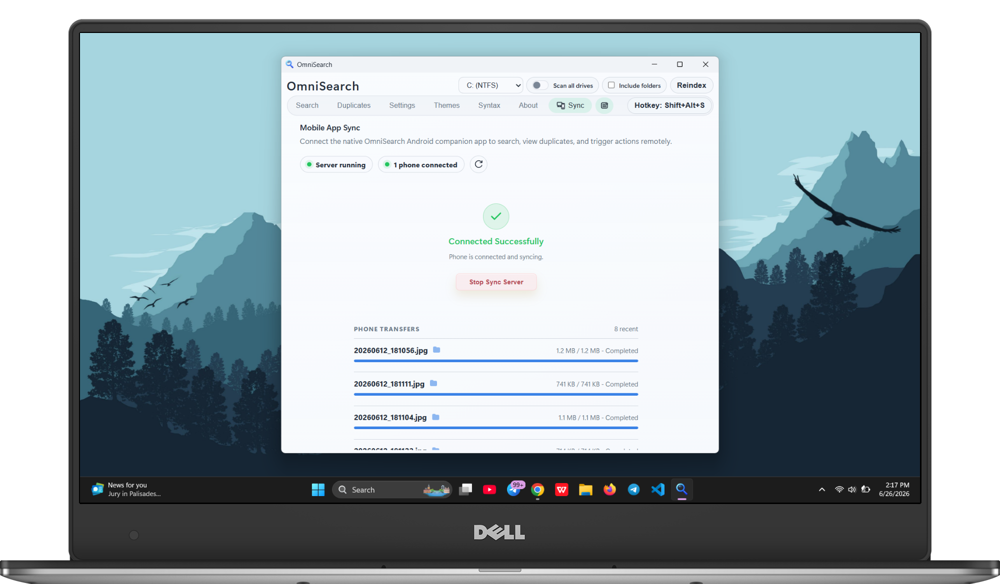
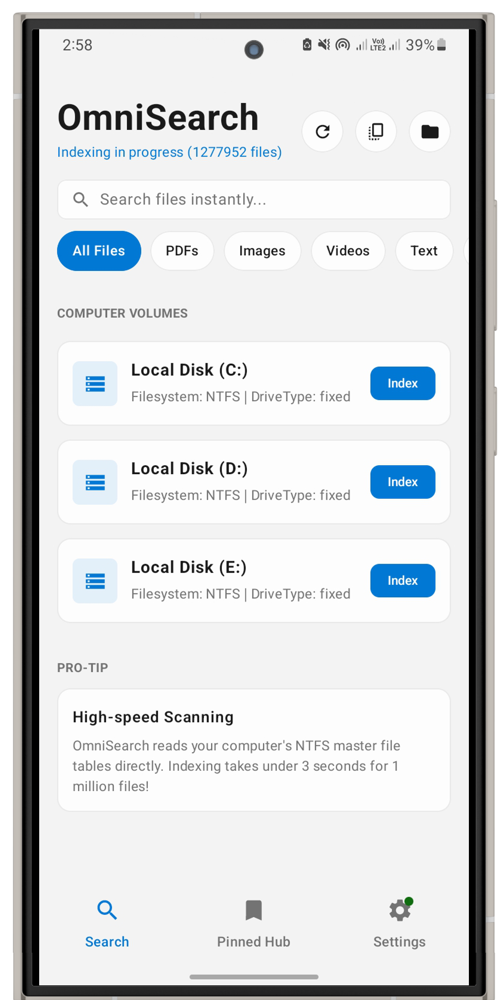

# OmniSearch

Fast Windows desktop file search built with Tauri v2, Rust, and C++.
OmniSearch reads NTFS metadata directly through USN/MFT APIs for quick global search, advanced filters, duplicate cleanup, and keyboard-friendly workflows.

<hr>

<h4 align="center">
  <a href="https://github.com/Eul45/omni-search/releases/latest">Install</a>
  &middot;
  <a href="https://www.eyuel.com.et/omni-search">Homepage</a>
  &middot;
  <a href="https://eyuel.com.et/omni-search/#faq">FAQ</a>
  &middot;
  <a href="https://github.com/Eul45/omni-search?tab=readme-ov-file#main-commands-tauri">Commands</a>
  &middot;
  <a href="https://github.com/Eul45/omni-search?tab=readme-ov-file#how-it-works">Architecture</a>
</h4>

<div align="center">
  <a href="https://github.com/Eul45/omni-search/releases/latest">
    
  </a>
  <a href="https://github.com/Eul45/omni-search/pulse">
    
  </a>
  <a href="https://github.com/Eul45/omni-search/blob/main/LICENSE">
    
  </a>
  <a href="https://tauri.app">
    
  </a>
  <a href="https://github.com/Eul45/omni-search/stargazers">
    
  </a>
</div>

<p align="center">&nbsp;</p>

<p align="center">
  
</p>

<p align="center">&nbsp;</p>

<p align="center"><strong>Search Experience</strong></p>
<p align="center">
  
</p>
<p align="center"><em>Main search tab with filters, categories, previews, and actions.</em></p>
<p align="center"><sub>──────────── · ────────────</sub></p>
<p align="center">&nbsp;</p>

<p align="center"><strong>Quick Window</strong></p>
<p align="center">
  
</p>
<p align="center"><em>Quick-search view with instant filters, keyboard-first flow, and a dedicated preview panel.</em></p>
<p align="center"><sub>──────────── · ────────────</sub></p>
<p align="center">&nbsp;</p>

<p align="center"><strong>Advanced Features</strong></p>
<p align="center">
  
  
</p>
<p align="center">
  <em>Duplicate Finder identifies identical files and shows reclaimable space, alongside advanced drive scope and indexing controls.</em>
</p>

<p align="center">&nbsp;</p>

<table align="center">
  <tr>
    <td><strong>Microsoft Store Version Features Only</strong></td>
    <td width="18"></td>
    <td>
      <a href="https://apps.microsoft.com/detail/9N7FQ8KPLRJ2">
        
      </a>
    </td>
  </tr>
</table>

<details>
<summary><strong>Preview Microsoft Store extras</strong></summary>

<p>custom background images for the app and a compact search bar mode.</p>

<p align="center">
  
  
</p>
</details>

<p align="center">&nbsp;</p>

<p align="center">
  
</p>

---

## Features
- Native Windows indexing engine in C++ using `DeviceIoControl` + USN/MFT enumeration.
- Live incremental index updates via USN journal watcher after initial scan.
- Rust FFI bridge exposing Tauri commands for indexing, searching, duplicates, drive listing, and file actions.
- Fast search UI with advanced filters: extension, file size range, created date range, clear buttons, and a compact layout toggle.
- Inline search syntax with `ext:` plus text content operators like `content:`, `ansicontent:`, `utf8content:`, `utf16content:`, and `utf16becontent:`.
- Hybrid search flow that keeps normal path/name lookups fast and only scans file contents from disk when you explicitly use content syntax.
- Duplicate finder with multithreaded hashing and grouped results (plus reclaimable size).
- Duplicate scan controls: live progress %, scanned/total counters, groups found, and cancel support.
- Drive picker with NTFS detection and volume access checks.
- Optional search scope toggle to scan all NTFS drives instead of only the selected drive.
- Optional `Include folders` indexing mode so folder paths can appear in search results.
- Advanced settings panel for configurable default search limit (persisted locally).
- Optional installed app search with real app icons, direct app launching, and integration into Recent activity.
- Recent activity remembers both searches and opened items, with pinning support to keep important entries at the top.
- Incremental `Load more` results flow that expands by your configured default limit step.
- Result tools: open file, reveal in folder, previews (image/video/pdf), Quick Look with the Space key, sort modes, and category tabs.
- Quick Window mode for compact search, fast hotkey access, a draggable results/preview splitter, and a dedicated selected-result preview surface.
- Search result context actions: open path, copy path, copy filename, copy full filename, rename, and delete.
- Optional Recycle Bin delete flow for both duplicate cleanup and standard search results.
- Native drag-out support so files can be dragged directly from result rows into Explorer or other apps.
- Theme gallery with multiple presets across dark and light mode, including Slate Glass, Win Slate, Metro, Aurora, Nordic Ink, Ember, Cedar, and Solar Sand.
- Desktop behavior settings for tray mode, background running, and configurable global shortcut handling.
- Full workspace / Quick Window switching from the tray menu, hotkey, and in-app controls.
- Light/dark theme toggle and dedicated Search / Duplicates / Settings / Themes / About tabs.
- Search syntax reference tab plus the standalone [Content Search Guide](CONTENT_SEARCH_GUIDE.md) for examples and operator details.
- Android companion app source in `android/` for local Wi-Fi search, previews, pinning, and approved file actions from your phone.
- Installer targets via Tauri bundle (MSI and NSIS).
- Windows manifest requests Administrator privileges (`requireAdministrator`) for raw volume access.

## Tech Stack

- Frontend: React 19, TypeScript, Vite
- Desktop shell: Tauri v2
- Bridge: Rust (`tauri`, `serde`, `cc`)
- Native engine: C++ (Win32 API, NTFS USN/MFT)
- Android companion: Kotlin, Jetpack Compose, Room, OkHttp
- Installer: WiX/MSI and NSIS via Tauri bundle

## Repository Structure

```text
omni-search/
├── src/                         # React & TypeScript UI
│   ├── App.tsx                  # Main Search Interface
│   ├── App.css                  # Custom Styling
│   └── main.tsx                 # Frontend Entry Point
├── public/                      # Static Assets
│   └── app-icon.png             # Frontend Favicon
├── src-tauri/                   # 🦀 Tauri (Rust) Backend
│   ├── cpp/                     # ⚙️ C++ High-Speed Engine
│   │   └── scanner.cpp          # Native NTFS Scanner (MFT Access)
│   ├── src/                     # Rust Source Code
│   │   ├── lib.rs               # FFI Bindings & Tauri Commands
│   │   └── main.rs              # App Entry & Lifecycle
│   ├── build.rs                 # C++ Compilation Script
│   ├── windows-app-manifest.xml # 🛡️ Admin Privileges (For Volume Access)
│   ├── tauri.conf.json          # Application Configuration
│   └── icons/                   # System App Icons
├── docs/                        # Documentation
│   └── images/                  # Architecture & Screenshots
├── index.html                   # HTML Entry Point
├── package.json                 # Node.js Dependencies
├── README.md                    # Project Documentation
└── CONTENT_SEARCH_GUIDE.md      # Guide for Content Search Implementation
```

## How It Works

1. React UI calls Tauri commands using `@tauri-apps/api`.
2. Rust command layer forwards calls to C++ through `extern "C"` FFI.
3. C++ scanner reads NTFS metadata via USN/MFT (`DeviceIoControl`) and builds in-memory index state.
4. Live USN watcher applies file changes after initial indexing to keep search current.
5. Search and duplicate results are serialized to JSON and returned to the UI.
6. Optional Android sync runs as a local-network companion client after desktop approval.

## OmniSearch Android Companion

OmniSearch now includes a native Android companion application (`android/`) designed to control and sync with your desktop over your local Wi-Fi network.

<p align="center">
  
  
  
</p>

### Connection & Sync Features
- **Local Discovery & Pairing**: Pairing is initiated by scanning a QR code displayed in the desktop app's Sync tab, transferring the local IP address, port, and session token.
- **Connection Security**: All connections operate purely on the local network (LAN) and require explicit manual authorization on the desktop application before any file data is exposed.
- **Synchronized Capabilities**:
  - Perform remote file searches on the PC's indexing engine directly from your phone.
  - Browse search categories, open PC directories, and pin items to your mobile hub.
  - Bidirectional file transfers: download discovered files from your PC to your phone, or upload media directly from your phone to your PC.
  - Built-in edge-to-edge media viewer for local Android files.

> **Secure Android Sync:** Android sync uses local-network `wss://` connections, desktop approval, and QR-code certificate pinning. See `android/README.md` for the full security model.

---

## Main Commands (Tauri)

- `start_indexing`, `index_status`
- `search_files`
- `find_duplicate_groups`, `duplicate_scan_status`, `cancel_duplicate_scan`
- `list_drives`
- `open_file`, `reveal_in_folder`, `delete_path`, `rename_path`
- `start_native_file_drag`
- `open_full_window_command`, `open_quick_window_command`
- `get_desktop_settings`, `update_desktop_settings`
- `sync_window_theme_command`
- `open_external_url`
- `load_preview_data_url`
- `list_installed_apps`, `launch_installed_app`, `reveal_installed_app`
- `start_sync_server_command`, `stop_sync_server_command`, `get_sync_server_status_command`

## Requirements

- Windows 10/11 (NTFS volume)
- Node.js 20+ and npm
- Rust stable toolchain (`x86_64-pc-windows-msvc`)
- Visual Studio 2022 C++ Build Tools (`Desktop development with C++`)
- WebView2 Runtime (normally preinstalled on Windows 11)
- Android Studio + JDK 17 if you want to build the Android companion app.

## Quick Start (Development)

```powershell
cd e:\omni-search
npm install
cd src-tauri
cargo check
cd ..
npm run tauri dev
```

Important:

- The app needs Administrator privileges to read `\\.\C:` for USN/MFT data.
- If indexing fails with "Unable to open volume", run the app elevated or use the packaged build with UAC prompt.

Android companion:

```powershell
cd android
.\gradlew.bat assembleDebug
```

## Build Installers (Distribution)

Build MSI:

```powershell
cd e:\omni-search
npx tauri build -b msi
```

Output path:

- `src-tauri/target/release/bundle/msi/omni-search_<version>_x64_en-US.msi`

Build EXE installer (NSIS):

```powershell
npx tauri build -b nsis
```

Output path:

- `src-tauri/target/release/bundle/nsis/`

## Customize App Icon / Branding

Generate all required Tauri icons from one square source image:

```powershell
npx tauri icon .\path\to\your-logo-1024.png --output .\src-tauri\icons
```

Update visible app metadata in `src-tauri/tauri.conf.json`:

- `productName`
- `app.windows[0].title`

## Troubleshooting

- `Unable to open volume`:
  - Run as Administrator.
  - Confirm target drive is NTFS: `fsutil fsinfo volumeinfo C:`.
- `cl.exe not found`:
  - Install Visual Studio C++ Build Tools and reopen terminal.
- App still shows old icon:
  - Regenerate icons, run `cargo clean`, rebuild, and restart Explorer (Windows icon cache).

### Sponsors
|  | Free code signing on Windows provided by [SignPath.io](https://about.signpath.io/),certficate by [SignPath Foundation](https://signpath.org/) |
|------------------------------------------------------------|-----------------------------------------------------------------------------------------------------------------------------------------------|

## Contributing

1. Fork the repo.
2. Create a feature branch.
3. Run checks (`cargo check`, `npm run build`).
4. Open a PR with test notes and benchmark notes if scanner logic changed.

## Star History

<a href="https://www.star-history.com/#Eul45/omni-search&type=date&legend=top-left">
 <picture>
   <source media="(prefers-color-scheme: dark)" srcset="https://api.star-history.com/svg?repos=Eul45/omni-search&type=date&theme=dark&legend=top-left" />
   <source media="(prefers-color-scheme: light)" srcset="https://api.star-history.com/svg?repos=Eul45/omni-search&type=date&legend=top-left" />
   
 </picture>
</a>
