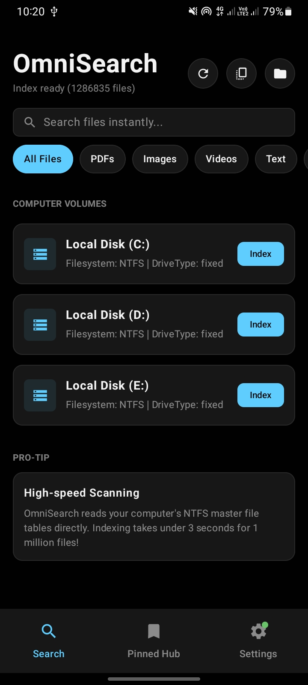
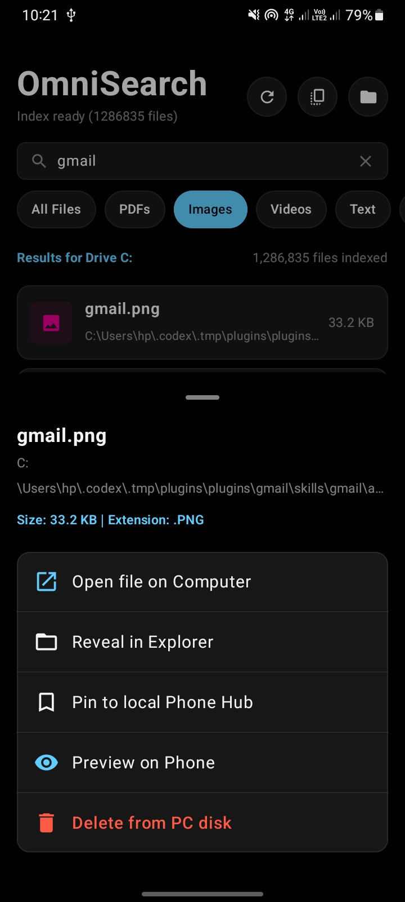
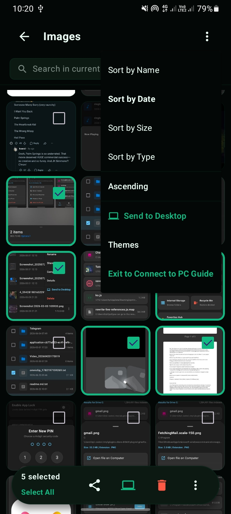

# OmniSearch Android Companion

A native, high-performance Android companion application for [OmniSearch Desktop](https://github.com/Eul45/omni-search). Built using Kotlin, Jetpack Compose, OkHttp WebSockets, and Room Database, it acts as a localized file manager and remote client to seamlessly interact with your PC over the local network.

---

## Application Preview

<p align="center">
  
  
  
</p>

---

## Key Features

*   File Explorer: Segmented category dashboard (Images, Videos, Audio, Docs, APKs, Downloads) styled with custom accent colors and cards.
*   Dual-Storage Support: Complete navigation for both internal storage and external SD cards, with robust back-stack handling to prevent directory trapping.
*   Bi-Directional Local Sync: Wirelessly send files to and from the desktop app via WebSockets.
*   Multi-Select Engine: Group file operations (Share, Copy, Cut/Move, Delete, Zip, and Favorite) with a clean bottom action drawer.
*   Security PIN Protection: Built-in application lock with 4-digit PIN authentication.
*   Legacy Version Compatibility: Backwards-compatible file I/O for older Android versions with automatic MediaScanner indexing.

---

## How It Works & Architecture

OmniSearch operates on a decentralized, local-network client-server model. The Tauri desktop application acts as the WebSocket host, while the Jetpack Compose Android client acts as the connecting node.

### Local Sync Workflow

```text
+-------------------+                      +--------------------+
|  Android Client   |                      |  Tauri Desktop App |
+---------+---------+                      +---------+----------+
          |                                          |
          |  1. Scan Desktop QR Code (IP/Port/PIN)   |
          +----------------------------------------->|
          |                                          |
          |  2. Initiate WebSocket Connection        |
          +=========================================>|
          |                                          |
          |  3. Connection Handshake & Approval      |
          |<-----------------------------------------+
          |                                          |
          |  4. Sync State (Clipboard, History)      |
          |<========================================>|
          |                                          |
          |  5. File Transfers (Chunked Stream)      |
          |<========================================>|
```

### Legacy Android I/O Integration

To support older Android versions, the application implements a features-detection fallback:

*   Android 10+ (API 29+): Utilizes the modern MediaStore.Downloads scoped storage API.
*   Legacy Android (API 21-28): Falls back to direct File System writing in public directory paths combined with MediaScannerConnection to guarantee immediate visibility in system galleries and file managers.

---

## Security & Privacy Model

*   **Zero Cloud Dependency**: All indexing, searching, and file sharing operations occur strictly within your local area network (LAN/Wi-Fi). No telemetry or files are ever sent to external cloud servers.
*   **Desktop Authorization**: The desktop app serves as the security gate. Any incoming sync connection from a mobile device must be explicitly approved by the desktop user.
*   **Secure LAN Encryption**: OmniSearch transfers files over encrypted WebSockets (`wss://`) using TLS 1.2/1.3. A self-signed certificate is dynamically generated by the desktop app on startup, and the Android client uses strict certificate pinning via the QR code. This ensures a secure, MITM-resistant connection over your local network **as long as the QR code is scanned directly from your trusted desktop screen**. Best used on trusted private Wi-Fi networks.
*   **Sandboxed Storage**: Private data, cached previews, and database records (such as pinned files) are stored locally in a Room database and SharedPreferences.

---

## Project Structure

```text
android/app/src/main/java/com/omnisearch/app/
├── MainActivity.kt           # Application lifecycle entry point
├── data/
│   ├── AppDatabase.kt        # Room Database initialization
│   ├── PinnedFileEntity.kt   # Schema for pinned items
│   ├── PinnedFileDao.kt      # Query definitions for pinned files
│   ├── LocalTrashManager.kt  # Legacy Recycle Bin wrapper
│   ├── PreferencesManager.kt # SharedPreferences wrapper (PIN, Sort, Theme)
│   └── SyncModels.kt         # Data schemas for WebSocket frames
└── ui/
    ├── MainScreen.kt         # Global shell containing navigation and drawer
    ├── LocalExplorerScreen.kt# File Manager UI
    ├── SearchScreen.kt       # Remote desktop search interface
    ├── SettingsScreen.kt     # App configuration, pairing, and PIN setups
    ├── PinnedScreen.kt       # Offline pinned files explorer
    ├── AppLockScreen.kt      # PIN unlock overlay UI
    ├── SyncViewModel.kt      # WebSocket communication engine
    ├── SecurityViewModel.kt  # Encryption and authorization state
    └── theme/
        └── Theme.kt          # Fluent CSS-inspired dark mode styling system
```

---

## Build & Installation

### Build Requirements
*   Android Studio (Koala or newer recommended)
*   JDK 17
*   Android SDK 24+ (compile SDK 36, target SDK 35)

### Building via Command Line

Configure your SDK paths and assemble the package:

```powershell
# Set SDK location (Windows example)
$env:ANDROID_HOME="E:\Sdk"
$env:ANDROID_SDK_ROOT="E:\Sdk"

# Compile and package preview build
.\gradlew.bat assemblePreview

# Compile and package debug build
.\gradlew.bat assembleDebug
```

The output APKs are written to:
*   Preview build: `app/build/outputs/apk/preview/app-preview.apk`
*   Debug build: `app/build/outputs/apk/debug/app-debug.apk`

---

## Developer Guidelines

1. Ensure code builds cleanly without warnings using `.\gradlew.bat compilePreviewKotlin`.
2. Follow standard Kotlin style guidelines.
3. If submitting modifications to the networking layer, verify backward compatibility with older API levels.
